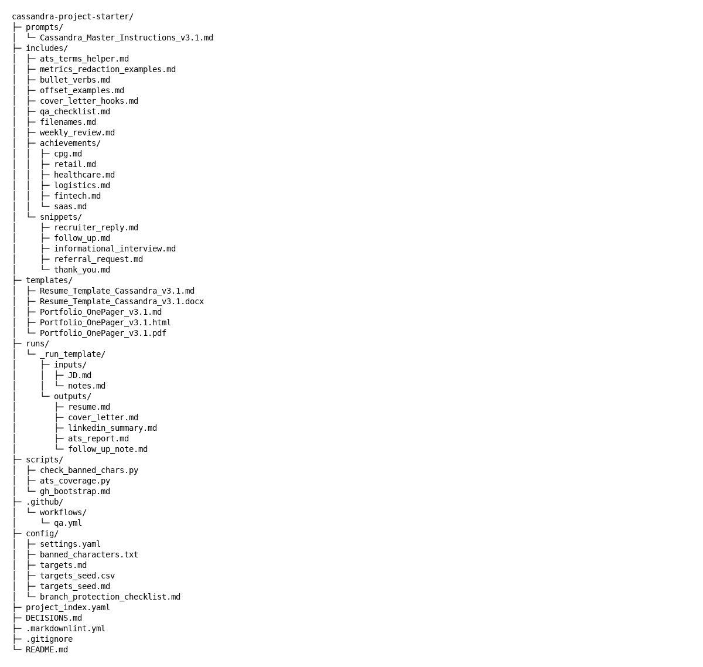
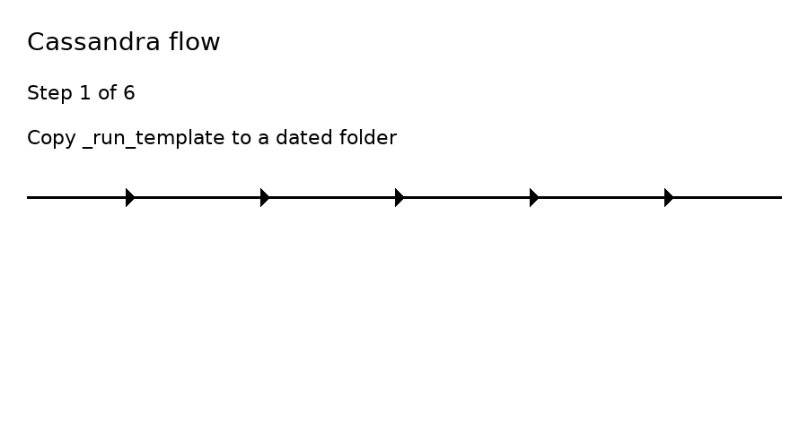

# Cassandra Project Starter, v3.1

This repo organises your job application machine so ChatGPT can work quickly with predictable outputs. British spelling with -ize is enforced and em dashes are banned.

## TLDR quick start
```bash
# 1) Create repo via GitHub CLI from this folder
gh repo create cassandra-project --private --source . --remote origin --push

# 2) Copy the run template and paste the JD
cp -r runs/_run_template runs/2025-09-09_TargetCo_Data_Analyst
# paste the JD into runs/2025-09-09_TargetCo_Data_Analyst/inputs/JD.md

# 3) In ChatGPT
# Ask it to use prompts/Cassandra_Master_Instructions_v3.1.md
# and write outputs into runs/2025-09-09_TargetCo_Data_Analyst/outputs/
```

## What is inside
- `prompts/` Cassandra master instructions, ready for ChatGPT.
- `includes/` helpers, ATS, offsets, QA, filenames, verbs, hooks, weekly review, domain achievements, snippets.
- `runs/_run_template/` copy and go folder for each new role, with inputs and outputs.
- `scripts/` small utilities, link checks and punctuation guard.
- `.github/workflows/` automated QA for links and markdown style.
- `config/` preferences, banned characters, targets.
- `templates/` authoritative resume template and portfolio one pager.

## Prerequisites
- Git and GitHub CLI installed if you want to use the `gh` bootstrap.
- Python 3.10 plus for running local helper scripts.
- A private GitHub repository or a Google Drive folder if you prefer Drive.

## How to use with GitHub
1. Create a private repo named `cassandra-project` or similar.
2. Add this starter. Commit and push.
3. Enable Actions. The QA workflow runs on pull requests and on main.
4. For each new role, copy `runs/_run_template` to `runs/YYYY-MM-DD_Company_Role/`.
5. Paste the JD into `inputs/JD.md` then open `prompts/Cassandra_Master_Instructions_v3.1.md` in ChatGPT and instruct it to generate outputs into the new run folder.
6. Optional, run the helper scripts locally before pushing, see below.

## How to use with Google Drive
1. Create a folder named `Cassandra Project`.
2. Mirror this structure. Keep file names short and avoid punctuation.
3. When sharing, grant read access, then point ChatGPT to `prompts/Cassandra_Master_Instructions_v3.1.md` and the `runs/.../inputs/JD.md` file.
4. Ask ChatGPT to write outputs into the corresponding `outputs/` folder.

## First run tutorial
1. Copy the template run folder to a dated target folder.
2. Paste the full JD into `inputs/JD.md` with original wording to preserve ATS terms.
3. In ChatGPT, say, Use `prompts/Cassandra_Master_Instructions_v3.1.md` and write outputs into `runs/YYYY-MM-DD_Company_Role/outputs/`.
4. ChatGPT will return, in order, `resume.md`, `cover_letter.md`, `linkedin_summary.md`, `ats_report.md`, and `follow_up_note.md`.
5. Run the QA checklist in `includes/qa_checklist.md`. Fix anything it flags.
6. Export the resume to DOCX and save with the filename rules in `includes/filenames.md`.

## Output contract
Each run produces, in `outputs/`:
- `resume.md` plain text, DOCX ready.
- `cover_letter.md` 180 to 220 words.
- `linkedin_summary.md` 120 to 180 words.
- `ats_report.md` coverage percent with missing terms and placements.
- `follow_up_note.md` 60 to 90 words.

## Local helper scripts
Run from the repo root.

### Ban list guard
Blocks em dashes across the project.
```bash
python3 scripts/check_banned_chars.py .
```

### ATS coverage preview
Quick unigram and bigram coverage check of a generated resume against a JD.
```bash
python3 scripts/ats_coverage.py runs/YYYY-MM-DD_Company_Role/inputs/JD.md runs/YYYY-MM-DD_Company_Role/outputs/resume.md
```

## Continuous integration
The QA workflow at `.github/workflows/qa.yml` runs on pushes and pull requests. It checks for banned punctuation, lints markdown, and scans links. Treat a failing check as a blocker for merging to main.

## Configuration and targets
- Tune preferences in `config/settings.yaml`, coverage target, word caps, and filename patterns.
- Maintain a rolling four week plan in `config/targets.md`.
- Seed lists are available in `config/targets_seed.csv` and `config/targets_seed.md`. Verify remote eligibility per posting.

## Templates
- Authoritative resume template, `templates/Resume_Template_Cassandra_v3.1.docx` and the markdown source.
- Portfolio one pager, `templates/Portfolio_OnePager_v3.1.pdf`, plus markdown and HTML source for edits.

## Guardrails
- British spelling with -ize forms.
- Ban em dashes entirely. Use commas or full stops.
- Link check before export. Readability target grade 8 to 10.
- Filename standard, see `includes/filenames.md`.

## Versioning and decisions
- Bump v3.x only when instructions change materially.
- Record any rule or structure change in `DECISIONS.md` including date and reason.

## Privacy
Keep confidential metrics safe. Use ranges and relative deltas as shown in `includes/metrics_redaction_examples.md`. Do not commit sensitive data, tokens, or credentials.

## Troubleshooting
- Coverage below 75 percent, open `ats_report.md`, add missing terms naturally into the Summary and relevant role bullets.
- CI fails on banned punctuation, run the ban list guard and fix the file that is flagged.
- Links failing in CI, update or remove dead links or add them to the link checker ignore list if appropriate.
- If ChatGPT output drifts, re-open `prompts/Cassandra_Master_Instructions_v3.1.md` and confirm the guardrails at the top.

## GitHub bootstrap
See `scripts/gh_bootstrap.md` for a one page sequence using the GitHub CLI to create the repo, push, and protect main.


## Project tree
```
cassandra-project-starter/
├─ prompts/
│  └─ Cassandra_Master_Instructions_v3.1.md
├─ includes/
│  ├─ ats_terms_helper.md
│  ├─ metrics_redaction_examples.md
│  ├─ bullet_verbs.md
│  ├─ offset_examples.md
│  ├─ cover_letter_hooks.md
│  ├─ qa_checklist.md
│  ├─ filenames.md
│  ├─ weekly_review.md
│  ├─ achievements/
│  │  ├─ cpg.md
│  │  ├─ retail.md
│  │  ├─ healthcare.md
│  │  ├─ logistics.md
│  │  ├─ fintech.md
│  │  └─ saas.md
│  └─ snippets/
│     ├─ recruiter_reply.md
│     ├─ follow_up.md
│     ├─ informational_interview.md
│     ├─ referral_request.md
│     └─ thank_you.md
├─ templates/
│  ├─ Resume_Template_Cassandra_v3.1.md
│  ├─ Resume_Template_Cassandra_v3.1.docx
│  ├─ Portfolio_OnePager_v3.1.md
│  ├─ Portfolio_OnePager_v3.1.html
│  └─ Portfolio_OnePager_v3.1.pdf
├─ runs/
│  └─ _run_template/
│     ├─ inputs/
│     │  ├─ JD.md
│     │  └─ notes.md
│     └─ outputs/
│        ├─ resume.md
│        ├─ cover_letter.md
│        ├─ linkedin_summary.md
│        ├─ ats_report.md
│        └─ follow_up_note.md
├─ scripts/
│  ├─ check_banned_chars.py
│  ├─ ats_coverage.py
│  └─ gh_bootstrap.md
├─ .github/
│  └─ workflows/
│     └─ qa.yml
├─ config/
│  ├─ settings.yaml
│  ├─ banned_characters.txt
│  ├─ targets.md
│  ├─ targets_seed.csv
│  ├─ targets_seed.md
│  └─ branch_protection_checklist.md
├─ project_index.yaml
├─ DECISIONS.md
├─ .markdownlint.yml
├─ .gitignore
└─ README.md
```



## Workflow at a glance
The high level flow from copy to export.




## Fast tailoring helpers
- `includes/quick_tailor_playbook.md`, how to run Bronze, Silver, Gold in 8, 15, 25 minutes.
- `includes/mto_pack_template.md`, a tiny starter you can paste when speed matters.
- Domain overlays in `includes/overlays/`, headline, summary and core skills per domain.
- Scripts, `scripts/new_run.py` to scaffold a run, and `scripts/quick_pack.py --domain <x>` to create an MTO pack in a run.
